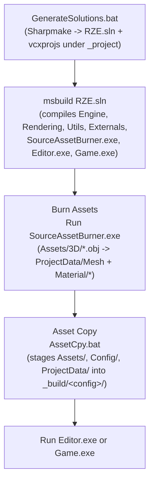

# Building & Running RZE

## Prerequisite: depot location

Per the repo README, the depot currently **must** be at `C:\dev\RZE` for `Tools\RZEHub.exe` to work correctly. This is a hard-coded assumption, not a configurable path.

## The canonical build sequence



This exact sequence is confirmed by `.github\workflows\Windows.yml` (the CI pipeline) and matches the manual steps in the README:

1. Run `Tools\RZEHub.exe`
2. Open and build the generated solution
3. Click **"Burn Assets"**, then **"Asset Copy"** in RZE Hub
4. Start the Editor or Game project (Game is the default)

RZEHub is a GUI front-end that (per its buttons' names) invokes `SourceAssetBurner.exe` and `AssetCpy.bat` for you rather than requiring the manual commands below.

## Doing it manually (what each step actually runs)

1. **Generate the solution**
   ```
   RZE\GenerateSolutions.bat
   ```
   Runs `Tools\Sharpmake\Sharpmake.Application.exe "/sources('RZE.sharpmake.cs')"`, producing `RZE.sln` and per-project `.vcxproj` files under `RZE\_project\`. See [09-BuildSystem/Sharpmake-Project-Graph.md](../09-BuildSystem/Sharpmake-Project-Graph.md).

2. **Compile**
   ```
   msbuild RZE.sln /property:Configuration=Debug   (or Release)
   ```
   Or use `RZE\BuildGame.bat` (one line: `msbuild _Project\Game.vcxproj -property:Configuration=Debug -property:Platform=x64`) to build just the Game project quickly. Output lands in `RZE\_build\<config>\`.

3. **Burn assets** (offline asset conditioning — see [05-AssetPipeline/Asset-Burning-Pipeline.md](../05-AssetPipeline/Asset-Burning-Pipeline.md) for what this actually does)
   ```
   _build\<config>\SourceAssetBurner.exe
   ```
   With no argument, this walks `Assets\3D\` and converts every `.obj` found into RZE's binary `.meshasset`/`.materialasset` formats under `ProjectData\`.

4. **Copy runtime data to the build output**
   ```
   RZE\AssetCpy.bat
   ```
   Copies `Assets\`, `Config\`, and `ProjectData\` into whichever of `_build\debug\` / `_build\release\` exist, via `xcopy /y /d /s /f`. Its own header comment calls this "crappy stuff... until a better build pipeline exists" — it's intentionally a stopgap, not a polished asset-cooking step.

5. **Run**
   - Game (default): `_build\<config>\RZE_Game.exe`
   - Editor: the built Editor executable in the same output folder

## CI reference (`.github\workflows\Windows.yml`)

Runs on `windows-2019`, matrix over `debug`/`release`. Steps:

1. Set up MSBuild + .NET 5.0.100
2. Checkout
3. `cd RZE && GenerateSolutions.bat`
4. `msbuild RZE/RZE.sln /property:Configuration=<config>`
5. Run `SourceAssetBurner.exe`
6. Run `AssetCpy.bat`
7. Archive `_build\<config>` as a build artifact (excluding `.lib`/`.pdb`/`.exp`/`.log`)

This is the single most authoritative source for "the correct build order" if these docs and the CI config ever diverge — trust the CI file.

## Key files

- `README.md`
- `GenerateSolutions.bat`, `BuildGame.bat`, `AssetCpy.bat`
- `.github\workflows\Windows.yml`
