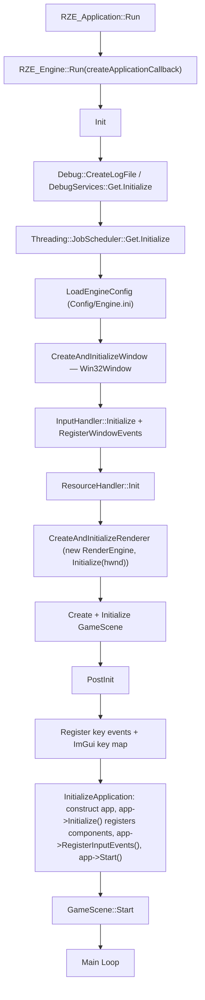
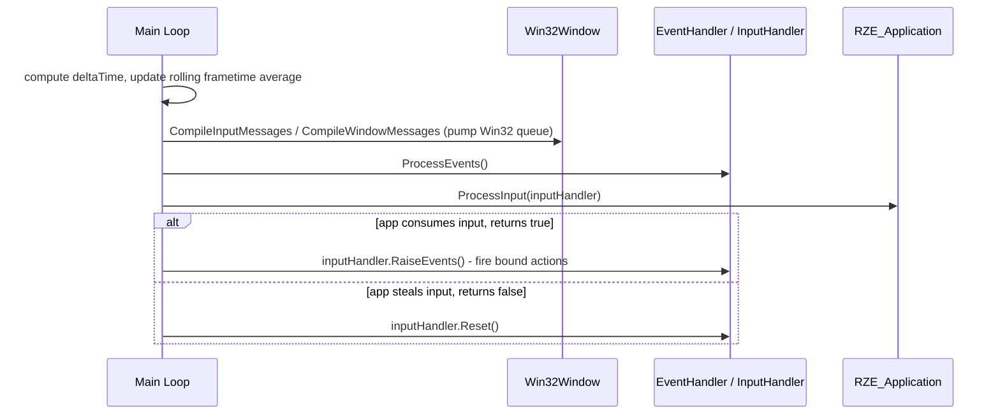
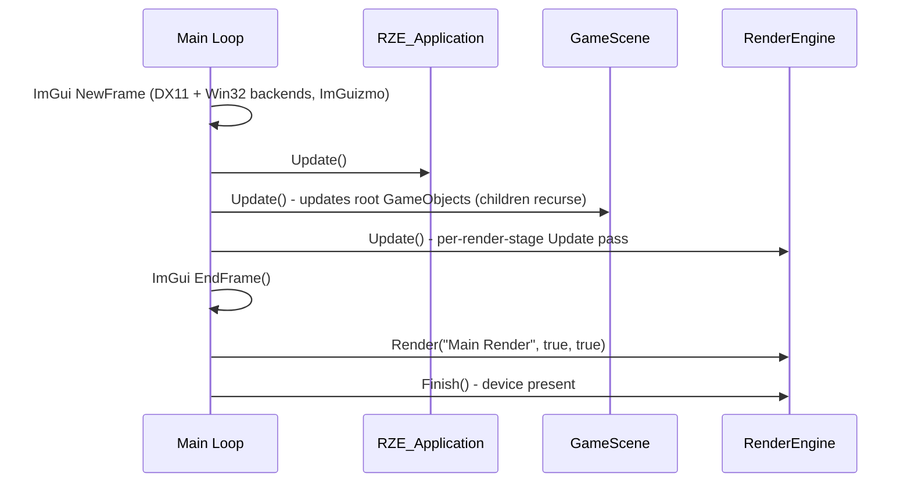

# Engine Startup & Frame Loop

The two central types in RZE are **`RZE_Engine`** (owns everything — window, renderer, scene, resources, input) and **`RZE_Application`** (a virtual base class overridden once per product: `GameApp`, `EditorApp`). There is no `main()` inside `Engine` itself — it's a library consumed by each product's entry point.

## The global engine accessor

`RZE\Engine\Src\RZE.h` / `RZE.cpp` expose a free function:

```cpp
RZE_Engine& RZE();
```

backed by a file-static global instance in `RZE.cpp`. This is used pervasively — `RZE().GetResourceHandler()`, `RZE().GetRenderEngine()`, `RZE().GetActiveScene()`, `RZE().GetInputHandler()`, `RZE().PostExit()` — as a **service locator**, not dependency injection. Almost any file in the codebase can reach any core subsystem through this single global.

## Entry points

```cpp
// RZE\Game\Src\Main.cpp
int main(int argc, char* argv[]) {
    GameApp gGameApp;
    if (argc > 1) gGameApp.ParseArguments(argv, argc);
    gGameApp.Run();
}
```

`RZE\Editor\Src\EditorMain.cpp` follows the identical shape with `Editor::EditorApp`. `RZE_Application::Run()` (in `EngineApp.cpp`) calls `RZE().Run(engineHook)`, passing a callback that knows how to construct the concrete application subclass.

## `RZE_Engine` (`Engine\Src\EngineCore\Engine.h` / `.cpp`)

Owns: `RZE_Application* m_application`, `GameScene* m_activeScene`, `Win32Window* m_window`, `ResourceHandler m_resourceHandler`, `EventHandler m_eventHandler`, `InputHandler m_inputHandler`, `std::unique_ptr<RenderEngine> m_renderEngine`, plus frame timing state (`m_deltaTime`, `m_frameCount`, a rolling `m_frameSamples` buffer for average frametime).

Public accessors used as the de-facto service locator: `GetApplication()`, `GetResourceHandler()`, `GetInputHandler()`, `GetRenderEngine()`, `GetActiveScene()`, `GetDeltaTime()`/`GetDeltaTimeMS()`, `ShowOpenFilePrompt()` (passes through to `Win32Window`'s native file dialog), `SetWindowSize()`, `PostExit()`.

## Startup sequence



1. **`Init()`**:
   - `Debug::CreateLogFile()`, `DebugServices::Get().Initialize()`
   - `Threading::JobScheduler::Get().Initialize()`
   - `LoadEngineConfig()` — loads `Config/Engine.ini` as an `EngineConfig` resource
   - `CreateAndInitializeWindow()` — constructs `Win32Window` sized/titled per config
   - `m_inputHandler.Initialize()`, `RegisterWindowEvents()` (subscribes to `EEventType::Window` → window resize/destroy handling)
   - `m_resourceHandler.Init()`
   - `CreateAndInitializeRenderer()` — `new RenderEngine`, `Initialize(hwnd)`
   - Creates and initializes the `GameScene`
2. **`PostInit(createApplicationCallback)`**: registers key events (ImGui key map), invokes the callback to construct the concrete `RZE_Application`, sets its window, calls `app->Initialize()` (registers all built-in `GameObjectComponent` types via `REGISTER_GAMEOBJECTCOMPONENT`), then `app->RegisterInputEvents()`, then `app->Start()`, then `m_activeScene->Start()`.

## Per-frame loop

Each iteration (`while (!m_shouldExit)`, wrapped in an Optick profiling frame) breaks into two phases: input/event processing, then update/render.

### Phase 1: input & event processing



The `ProcessInput` return value is a deliberate hook: returning `false` means the application is "stealing" input (e.g. the Editor consuming mouse/keyboard for ImGui panels) so the engine resets input state instead of firing gameplay-bound actions that frame.

### Phase 2: update & render



This phase runs unconditionally every frame, immediately after the input phase above.

## Shutdown

`BeginShutDown()` → scene shutdown → app shutdown → `renderEngine->ClearObjects()` → `resourceHandler.ShutDown()` → `renderEngine->Shutdown()` → `JobScheduler::ShutDown()` → `InternalShutDown()` deletes the scene, renderer, and window.

## Key files

- `Engine\Src\RZE.h` / `RZE.cpp` — global `RZE()` accessor
- `Engine\Src\EngineCore\Engine.h` / `Engine.cpp` — `RZE_Engine`
- `Engine\Src\EngineApp.h` / `EngineApp.cpp` — `RZE_Application`
- `Game\Src\Main.cpp`, `Editor\Src\EditorMain.cpp` — the two entry points
