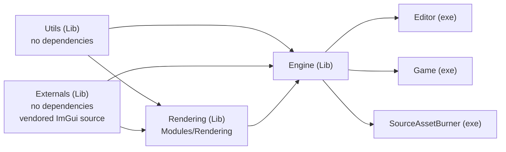

# Module Dependency Graph

RZE is generated as a Visual Studio solution by [Sharpmake](https://github.com/ubisoft/Sharpmake) (a C#-based build config generator, similar in spirit to CMake/Premake). The root definition is `RZE\RZE.sharpmake.cs`, which pulls in every project via `[module: Sharpmake.Include(...)]` and registers them against a single `RZE : Solution` class.

## The dependency chain

Reading bottom-to-top:

- **`Utils`** has zero RZE dependencies.
- **`Externals`** (vendored ImGui + ImGuizmo/ImCurveEdit/ImGradient/ImSequencer/GraphEditor source) also has zero RZE dependencies.
- **`Modules/Rendering`** depends only on `Utils` + `Externals`.
- **`Engine`** depends on all three lower layers (`Utils`, `Externals`, `Rendering`).
- **`Editor`**, **`Game`**, and **`SourceAssetBurner`** each declare only one explicit dependency — `Engine` — and get `Utils`/`Externals`/`Rendering` for free. This works because Sharpmake's `AddPublicDependency<T>` propagates *public* dependencies transitively: anything that publicly depends on `Engine` also inherits Engine's own public include paths and lib paths. All three executables have converged on this same single-dependency pattern.

This one-directional structure is enforced only by which Sharpmake project declares a dependency on which (`conf.AddPublicDependency<T>(target)`) — there's no build-time circular-dependency detection beyond what MSBuild/the linker would catch naturally.

## Per-project summary

| Project             | Type       | Explicit `AddPublicDependency<T>`                            | Purpose                                                                                                                                                                                                                                                      |
| ------------------- | ---------- | ------------------------------------------------------------ | ------------------------------------------------------------------------------------------------------------------------------------------------------------------------------------------------------------------------------------------------------------ |
| `Utils`             | static Lib | *(none)*                                                     | Fixed-width typedefs, GLM-backed math (Vector2/3/4D, Matrix4x4, Quaternion), `Filepath`/`File`, `Functor`, `Debug`/assert macros, `ByteStream`, `ReflectDB`. See [Utils-Library-Reference.md](../06-Platform-And-Infrastructure/Utils-Library-Reference.md). |
| `Externals`         | static Lib | *(none)*                                                     | Vendored Dear ImGui source + community widget extensions (ImGuizmo, ImCurveEdit, ImGradient, ImSequencer, GraphEditor).                                                                                                                                      |
| `Modules/Rendering` | static Lib | Externals, Utils                                             | Self-contained DX11 renderer: command-buffer render thread, `MemArena`, opaque buffer/shader handles, DX11 driver layer. See [Low-Level-Renderer-Module.md](../04-Rendering/Low-Level-Renderer-Module.md).                                                   |
| `Engine`            | static Lib | Utils, Externals, Rendering                                  | `RZE_Engine`/`RZE_Application`, scene graph, GameObject/component system, engine-side graphics layer (`RenderEngine`, render stages, materials/meshes), resource management, input/event/window systems, asset import.                                       |
| `SourceAssetBurner` | exe        | Engine *(only)* — `Utils` inherited transitively             | Offline tool that converts source 3D assets (via Assimp) into RZE's binary asset formats. See [Asset-Burning-Pipeline.md](../05-AssetPipeline/Asset-Burning-Pipeline.md).                                                                                    |
| `Editor`            | exe        | Engine *(only)* — `Utils`/`Rendering` inherited transitively | ImGui-based scene editor. See [07-Editor](../07-Editor/Editor-Overview.md).                                                                                                                                                                                  |
| `Game`              | exe        | Engine *(only)* — `Utils`/`Rendering` inherited transitively | The playable game shell. See [08-Game](../08-Game/Game-App.md).                                                                                                                                                                                              |

**Note on `Editor` and `SourceAssetBurner`:** both also call `conf.IncludePaths.Add(Path.Combine(Globals.RootDir, "Utils"))` — a raw include-path addition pointing at the `Utils` project *root* (not `Utils\Src`, where the actual headers live).

- Since both projects already receive the correct `Utils\Src` include path transitively through their dependency on `Engine`, this extra line appears redundant/vestigial rather than load-bearing — worth a cleanup pass, but not something that currently breaks the build.
- `SourceAssetBurner`'s Sharpmake file previously also declared an explicit `AddPublicDependency<Utils>` alongside `Engine`; that line has since been removed, bringing it in line with `Editor`/`Game`'s single-dependency pattern.
- If you're comparing against an older checkout or a cached mental model: expect this project list to keep converging further as the build config is cleaned up.

## Where this is defined

- `RZE\RZE.sharpmake.cs` — solution root, registers all 7 native projects (plus the C# `SharpmakeProjectBase` wrapping Sharpmake itself) against a single Win64 target.
- `RZE\Make\Sharpmake\BaseProject.sharpmake.cs` — abstract `BaseProject : Project` that every native project derives from; centralizes include paths, output paths (`_Build/[target.Name]/`), C++17 + RTTI + exceptions, warnings-as-errors.
- `RZE\Make\Sharpmake\CommonTarget.sharpmake.cs` — defines the build target axes: `SubPlatformType` (only `x64` is active), `Mode` (only `Game` is active — `Editor` mode is commented out), `Optimization` (Debug/Release/Retail).
- Per-project `*.sharpmake.cs` files (`Engine\Engine.sharpmake.cs`, `Modules\Rendering\Rendering.sharpmake.cs`, etc.) — each declares its own `AddPublicDependency<T>` calls; see [09-BuildSystem/Sharpmake-Project-Graph.md](../09-BuildSystem/Sharpmake-Project-Graph.md) for the full breakdown.

A `Globals` static class in `RZE.sharpmake.cs` centralizes shared paths: `RootDir`, `IncludeDir` (`ThirdParty/Include/`), `LibDir` (`_Build/[target.Name]/`), `ThirdPartyLibDir`/`ThirdPartyDllDir` (`ThirdParty/Lib(or Dll)/x64/`).
