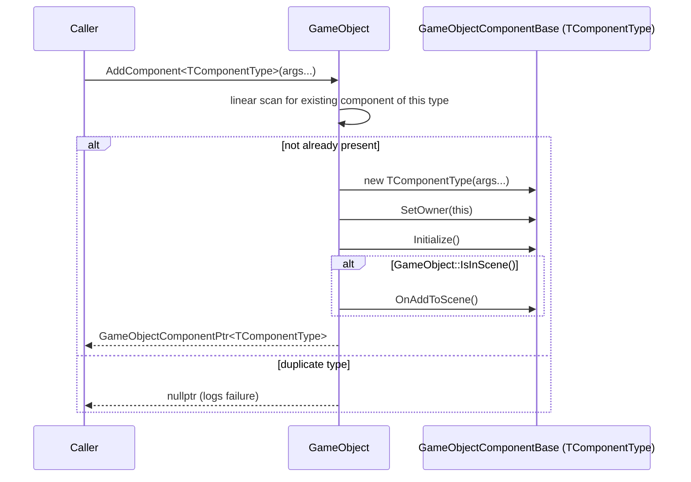

# The Component System (and its documented inheritance bug)

RZE's components use a hand-rolled "poor man's reflection" system to assign a stable type ID to each component type, so that scenes can serialize components by name/ID and the editor can offer an "Add Component" menu. This is a real, in-source-documented weak point of the engine — worth understanding precisely, because it constrains how new components can be authored today.

## The base class

`Engine\Src\Game\World\GameObject\GameObjectComponent.h` defines:

```cpp
class GameObjectComponentBase {
public:
    virtual void Initialize() = 0;
    virtual void OnAddToScene() = 0;
    virtual void OnRemoveFromScene() = 0;
    virtual void Update() = 0;
    virtual void Serialize(rapidjson::PrettyWriter<rapidjson::StringBuffer>& writer) = 0;
    virtual void Deserialize(const rapidjson::Value& data) = 0;
    virtual void OnEditorInspect() = 0;   // drives the editor's per-component inspector panel

    GameObjectComponentID m_id;
    GameObject* m_owner;
};
```

`OnEditorInspect()` being a first-class virtual on every component (not an editor-only add-on) shows how tightly the in-engine editor tooling is woven into the core component contract, rather than layered on separately.

## CRTP type-ID assignment

Concrete components don't inherit `GameObjectComponentBase` directly — they inherit the CRTP template `GameObjectComponent<TComponentType>`:

```cpp
template <typename TComponentType>
class GameObjectComponent : public GameObjectComponentBase {
public:
    GameObjectComponent() { m_id = GetID(); m_componentName = GetComponentName(); }
    static GameObjectComponentID GetID() {
        return GameObjectComponentTypeID<GameObjectComponentBase>::GetComponentTypeID<TComponentType>();
    }
    // default no-op overrides for every virtual — subclasses only override what they need
};
```

`GameObjectComponentTypeID<TComponentBase>::GetComponentTypeID<TComponentType>()` assigns a monotonically-increasing static ID the first time each concrete `TComponentType` is instantiated/queried:

```cpp
template <class TComponentType>
static inline GameObjectComponentID GetComponentTypeID() {
    static GameObjectComponentID id = s_nextComponentID++;
    return id;
}
```

## Registration and the factory registry

`GameObjectComponentRegistry` (namespace, same header) holds:
- a name↔ID map (`ComponentNameIDMap`)
- a factory-function map (`Functor<GameObjectComponentBase*()>` per ID)

populated via the `REGISTER_GAMEOBJECTCOMPONENT(ComponentType)` macro:

```cpp
#define REGISTER_GAMEOBJECTCOMPONENT(ComponentType)                                          \
{                                                                                             \
    GameObjectComponentTypeID<GameObjectComponentBase>::GetComponentTypeID<ComponentType>();  \
    GameObjectComponentRegistry::RegisterComponentType(ComponentType::GetID(), #ComponentType);\
    GameObjectComponentRegistry::AddComponentFactory(ComponentType::GetID(),                  \
        Functor<GameObjectComponentBase*>([]() { return new ComponentType(); }));             \
}
```

This macro is invoked once per built-in component type inside `RZE_Application::Initialize()` (base class), and again by each app subclass for its own product-specific components (e.g. Editor registers `EditorCameraComponent`). This is what lets load code and the editor's "Add Component" menu call `GameObjectComponentRegistry::CreateComponentByID(id)` without knowing the concrete type at compile time.

## The documented inheritance bug

The header carries a long, candid comment explaining a real limitation:

> "This stuff doesn't support class hierarchies, and will only ever use the first registered component in any hierarchy. Needs to be refactored to support this. As such, things like `CameraComponent` are broken because I refactored `EditorCameraComponent` to inherit from `CameraComponent`; this means we can't have both a `CameraComponent` and `EditorCameraComponent` reflected because the ID will be the same, and the ID is the driving factor behind all recognition of unique classes."

Why: `GameObjectComponentTypeID<GameObjectComponentBase>::GetComponentTypeID<TComponentType>()` is only ever instantiated for the **first** concrete type in a hierarchy that goes through `GameObjectComponent<T>`. Given `EditorCameraComponent : CameraComponent : GameObjectComponent<CameraComponent>`, the compiler resolves `GameObjectComponent<CameraComponent>`'s constructor for both classes (since `EditorCameraComponent` never itself instantiates `GameObjectComponent<EditorCameraComponent>` — it inherits the already-compiled `CameraComponent` machinery), so both classes end up sharing `CameraComponent`'s ID. There is no way today to have a component subclass another component and get a distinct type ID/factory entry.

**Practical implication for future component authors:** don't derive one `GameObjectComponent`-based type from another expecting independent registration/serialization identity — it silently collides. `EditorCameraComponent` works around this in practice by never needing to coexist with a plain `CameraComponent` on the same object, and by separately using the *unrelated* `Utils\Reflect\ReflectDB` system (`REFLECT_REGISTER_COMPONENT_CHILD`) purely for editor inspector sort-ordering, not for the ID/factory system described here. See [10-KnownIssues](../10-KnownIssues/Architectural-Notes-And-TODOs.md) for more.

## Sequence: adding a component to a GameObject already in the scene



## Key files

- `Engine\Src\Game\World\GameObject\GameObjectComponent.h`
- `Editor\Src\Game\World\GameObjectComponents\EditorCameraComponent.h/.cpp` — the concrete example of the bug in practice
- `Editor\Src\EditorApp.cpp` — `EditorComponentCache`/`REGISTER_EDITORCOMPONENTCACHE_ORDERDATA` (separate, editor-only inspector sort-order system)
- `Utils\Src\Utils\Reflect\Reflection.h`, `ReflectDB.h/.cpp` — the unrelated general-purpose reflection registry also used by `EditorCameraComponent`
