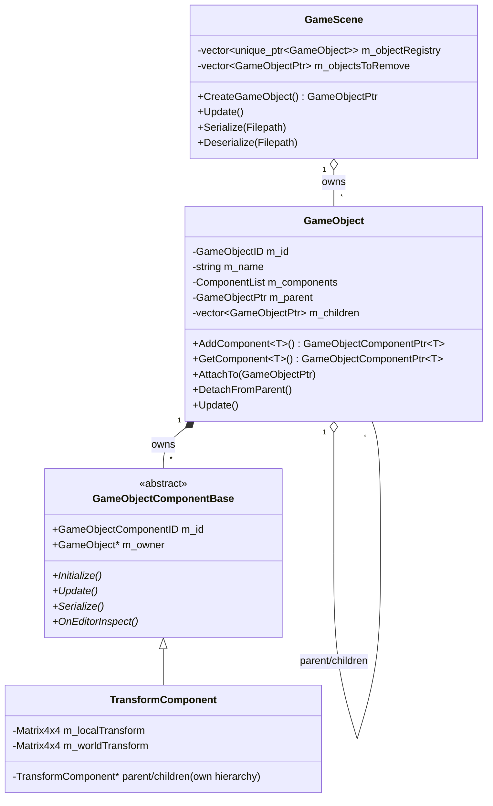

# Scene & GameObject Model

RZE's world is a scene graph of `GameObject`s, each carrying a set of polymorphic components. This is entity + component **composition**, not a data-oriented/archetype ECS — components are heap-allocated and stored as base-class pointers.

## `GameScene` (`Engine\Src\Game\GameScene.h` / `.cpp`)

`GameScene` owns the entire world: `std::vector<std::unique_ptr<GameObject>> m_objectRegistry`, plus a deferred-removal list `m_objectsToRemove` (removals are queued and flushed at the top of the next `Update()`, not applied immediately, so it's safe to remove a GameObject while iterating the scene mid-frame).

Key API:
- `CreateGameObject()` — always attaches a `TransformComponent` first, since "all gameobjects have a spatial representation" (source comment). Use this instead of constructing `GameObject` directly.
- `AddGameObject(name)` / `AddGameObject(GameObjectPtr)`, `RemoveGameObject`, `FindGameObjectByName`, `ForEachGameObject(Functor<void, GameObjectPtr>)`.
- `Update()` — processes deferred removals, then calls `Update()` only on **root** GameObjects; children are updated transitively because `GameObject::Update()` recurses into its own children.
- `Serialize(Filepath)` / `Deserialize(Filepath)` / `NewScene()` — JSON scene persistence via RapidJSON. A scene file's top-level shape is a `gameobjects` object keyed by GameObject name, each holding a `components` map keyed by component type name. Confirmed against `Assets\Scenes\Default.scene`.
- `Start()` / `ShutDown()` / `Unload()` — lifecycle hooks called by `RZE_Engine`.

## `GameObject` (`Engine\Src\Game\World\GameObject\GameObject.h` / `.cpp`)

The "entity." Holds:
- `GameObjectID m_id`, `std::string m_name`
- `ComponentList m_components` — `typedef std::vector<GameObjectComponentBase*> ComponentList`
- `GameObjectStateFlags m_stateFlags` — bitfields `IsInScene : 1`, `IncludeInSave : 1`
- A **scene-graph hierarchy** of its own: `GameObjectPtr m_parent`, `std::vector<GameObjectPtr> m_children`, with `AttachTo(GameObjectPtr)` / `DetachFromParent()`, `IsRoot()`, `NumChildren()` / `HasChildren()` / `GetChildAtIndex(index)`.

Component API (templated, defined inline in the header):
```cpp
template <typename TComponentType, typename... Args>
GameObjectComponentPtr<TComponentType> AddComponent(Args... args);   // rejects duplicate types (linear scan)

template <typename TComponentType>
GameObjectComponentPtr<TComponentType> GetComponent();                // linear scan by TComponentType::GetID()

template <typename TComponentType>
void RemoveComponent();                                                // linear scan + delete

GameObjectComponentBase* AddComponentByID(GameObjectComponentID id);   // for load/editor code only
```
All three templated lookups are a linear `std::find_if` over `m_components` — the header itself flags this with `// #TODO Slow function` on each. Fine for the current object/component counts; would need an index (e.g. a type→pointer map) to scale.

`AddComponent<T>` flow: constructs `new TComponentType(args...)`, pushes it, calls `component->SetOwner(this)`, then `component->Initialize()`, and if the owning GameObject is already in the scene, also immediately calls `component->OnAddToScene()`.

Persistence: `Save(rapidjson::PrettyWriter<...>&)` / `Load(rapidjson::Value&)` serialize the GameObject's own state and delegate to each component's own `Serialize`/`Deserialize`.

## Object relationship diagram



## Handle types: `GameObjectPtr` / `GameObjectComponentPtr<T>`

Defined in `Game\World\GameObject\GameObjectDefinitions.h`. These are thin non-owning wrapper types around raw pointers, with private raw-pointer constructors restricted via `friend` to `GameObject`/`GameScene`. The intent is to prevent external code from constructing objects itself and to leave room for a future indirection layer (e.g. slot-map-style handles) without changing call sites — today they still just wrap a raw pointer under the hood.

## Key files

- `Engine\Src\Game\GameScene.h` / `.cpp`
- `Engine\Src\Game\World\GameObject\GameObject.h` / `.cpp`
- `Engine\Src\Game\World\GameObject\GameObjectDefinitions.h`
- `Assets\Scenes\*.scene` — example serialized scenes (JSON)
