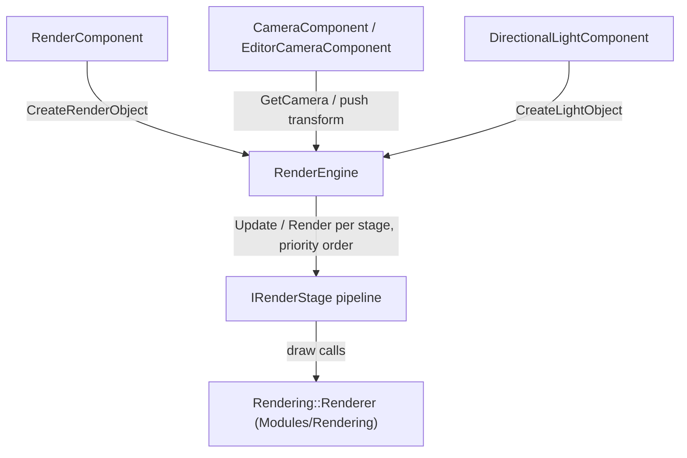

# Engine Graphics Layer: `RenderEngine`

`RenderEngine` (`Engine\Src\Graphics\RenderEngine.h` / `.cpp`) is the engine-side rendering coordinator, owned by `RZE_Engine` as `std::unique_ptr<RenderEngine>`. It sits directly on top of the low-level `Rendering::Renderer` API ([Low-Level-Renderer-Module.md](Low-Level-Renderer-Module.md)) and is the bridge that `GameObjectComponent`s (`RenderComponent`, `CameraComponent`, `DirectionalLightComponent`) talk to via `RZE().GetRenderEngine()`.

## Scene data it owns

```cpp
struct RenderEngine::SceneData {
    RenderObjectContainer renderObjects;   // vector<unique_ptr<RenderObject>>
    LightObjectContainer  lightObjects;    // vector<unique_ptr<LightObject>>
    DebugLineContainer    debugLines;      // vector<DebugLine>
};
```

This is a render-facing scene, deliberately decoupled from `GameScene`/`GameObject` — a `RenderObject` doesn't know about the `GameObject` that created it, only a mesh + transform.

- **`RenderObject`** — pairs a `StaticMeshInstance` with a `MatrixMem { Matrix4x4 transform; Matrix4x4 invTransform; }`. A source comment flags this as a placeholder to be replaced once a batching system exists ("will pack all geometry into a single vertex buffer and all materials into a single material buffer and index away").
- **`LightObject`** — position/colour/strength plus a GPU constant buffer handle (`Rendering::ConstantBufferHandle`); its `PropertyBufferLayout` is uploaded directly to the GPU.
- **`RenderCamera`** — `Matrix4x4 ClipSpace`, `Vector3D Position`, `RenderViewport Viewport` (just a `Vector2D Size` today). `CameraComponent`/`EditorCameraComponent` push into this each frame via `RenderEngine::GetCamera()`.

## Object lifecycle

```cpp
RenderObjectPtr CreateRenderObject(const StaticMeshInstance& staticMesh);
void DestroyRenderObject(RenderObjectPtr& renderObject);
LightObjectPtr CreateLightObject();
void DestroyLightObject(LightObjectPtr& lightObject);
void DrawLine(const Vector3D& start, const Vector3D& end);   // queues a DebugLine
```

Both containers use swap-and-pop erase (`ContainerUtils::VectorEraseBack`, from `Utils`) on removal rather than ordered erase, since element order in these containers isn't meaningful.

## The stage pipeline

`Initialize(windowHandle)` calls `Rendering::Renderer::Initialize`, then registers the always-on stages: `ForwardRenderStage`, and (Debug builds only) `DebugDrawRenderStage`. `AddRenderStage<T>(args...)` is a template that constructs `new TRenderStageType(args...)` and inserts it into `m_renderStages`, kept sorted by `IRenderStage::GetPriority()`. See [Render-Stages.md](Render-Stages.md) for the concrete stages and ordering.

Per frame:
```cpp
void Update();                                             // calls Update(camera, sceneData) on every stage
void Render(const char* frameName, bool isMainRenderCall, bool withImgui);
void Finish();                                              // Rendering::Renderer::DevicePresent()
```
`Render()` wraps `Rendering::Renderer::BeginFrame`/`EndFrame` and iterates stages in priority order calling `Render()`, skipping the ImGui stage (priority 1000) when `withImgui` is false.

## Rendering to an arbitrary target: `RenderView`

```cpp
void RenderView(const char* frameName, const RenderCamera& renderCamera,
                 std::unique_ptr<Rendering::RenderTargetTexture>& renderTarget);
```

Temporarily swaps the active camera/viewport/render-target state, renders, then restores it — this is what lets the Editor render the exact same scene from an arbitrary camera into an off-screen texture (its viewport) without a second, parallel rendering path. `ResizeCanvas(newSize)` propagates a window resize down into `Rendering::Renderer::HandleWindowResize` and updates ImGui's `DisplaySize`.

## Diagram: RenderEngine's place in the pipeline



## Key files

- `Engine\Src\Graphics\RenderEngine.h` / `.cpp`
- `Engine\Src\Graphics\RenderStage.h`
- `Engine\Src\Graphics\GraphicsDefines.h` — `RenderObjectPtr` / `LightObjectPtr` handle wrappers
