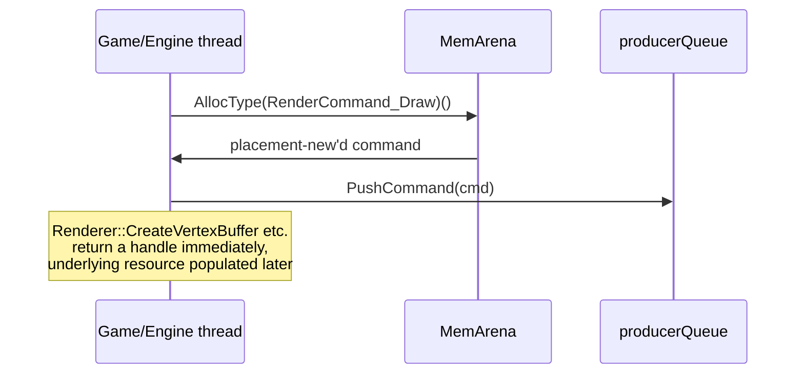
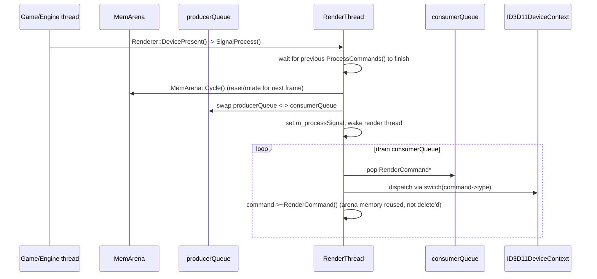

# Low-Level Renderer Module (`Modules\Rendering`)

This is a self-contained, DirectX 11–backed rendering library, deliberately decoupled from `Engine` (Engine depends on it, not the other way around — see [Module-Dependency-Graph.md](../02-Architecture/Module-Dependency-Graph.md)). Its defining architectural feature is a **producer/consumer command-buffer renderer with a dedicated render thread**: game/engine code never touches D3D11 directly, it only ever queues commands and receives opaque handles.

## Directory map

- `Renderer.h` / `.cpp` — the public static-method facade (`class Renderer`, no instance state besides a static `RenderThread`). This is the only entry point game/engine code should call.
- `RenderThread.h` / `.cpp` — worker thread owning the actual `DX11Device` and executing queued commands.
- `RenderCommand.h` — `RenderCommandType` enum + one POD struct per command, all deriving `RenderCommand`.
- `MemArena.h` / `.cpp` — the frame-scoped bump allocator backing every render command.
- `BufferHandle.h`/`.cpp`, `ShaderHandle.h` — opaque `shared_ptr`-wrapping handle types.
- `Driver/` — hardware abstraction interfaces (`IGFXDevice`, `IVertexBuffer`/`IIndexBuffer`/`IConstantBuffer`/`ITextureBuffer2D`, `IVertexShader`/`IPixelShader`) plus the concrete `Driver/DX11/` implementations (`DX11Device`, `DX11VertexBuffer`, `DX11IndexBuffer`, `DX11ConstantBuffer`, `DX11TextureBuffer2D`, `DX11VertexShader`/`DX11PixelShader`, `DX11TypeConversion`).
- `Graphics/` — `RenderTarget.h/.cpp` (`RenderTargetTexture`, used by both Editor and Game as their "screen" surface) and `Texture.h/.cpp` (`TexturePack`, a texture-array abstraction).
- `old_RenderCommands.h` — vestigial dead code from a prior command-struct design, not referenced anywhere current (see [10-KnownIssues](../10-KnownIssues/Architectural-Notes-And-TODOs.md)).

## The command-buffer render thread pattern

### Submission: game/engine thread queues a command

### Processing: render thread drains the queue

1. **`MemArena`** — a bump allocator with a fixed 64MB size (`MemoryUtils::Megabytes(64)`, set in `Renderer::Initialize`). `MemArena::AllocType<T>()` placement-news a `T` inside arena memory. Tracks a pressure level (`PressureValue::LOW`/`MED`/`HIGH`), last-frame allocation size, and peak usage — surfaced live in the Editor's menu bar memory readout.
2. Every `Renderer::*` static call allocates a `RenderCommand_*` struct out of the arena, fills in parameters (deep-copying transient data where needed), and pushes it onto `RenderThread::m_producerQueue` via `PushCommand`. Creation calls (`CreateVertexBuffer`, `CreateVertexShader`, etc.) synchronously return a caller-visible handle wrapping a `shared_ptr` to the concrete DX11 object — but that object is only populated **later**, asynchronously, when the render thread actually executes the command (`cmd->bufferPtr->Allocate(...)`). Callers get a handle immediately and must not assume the resource is ready before the render thread has processed it.
3. **`RenderThread`** runs a dedicated `std::thread` looping `Update()`, waiting on a `std::condition_variable` (`m_updateCondition`/`m_processSignal`). `Renderer::DevicePresent()` calls `SignalProcess()`, which waits for prior processing to finish, calls `MemArena::Cycle()`, swaps `m_producerQueue`/`m_consumerQueue` (classic double-buffered command queue — the header notes these queues are "guaranteed to be contiguous as its backed by MemArena"), then wakes the render thread. `ProcessCommands()` drains the consumer queue via a large `switch (command->type)`, dispatching directly against `ID3D11DeviceContext` calls, and explicitly destructs each command afterward (`command->~RenderCommand()`) — memory is reused via the arena's next `Cycle()`, never `delete`d individually.
4. This decouples game/render-logic submission from GPU-thread execution — a hand-rolled version of the "render command list"/deferred-context pattern, implemented without D3D11's actual deferred contexts.

## `RenderCommandType` (full list, from `RenderCommand.h`)

Frame/pass control: `BeginFrame`, `EndFrame`, `Begin`, `End`, `DevicePresent`, `HandleWindowResize`, `ImGuiRender`.
Resource creation: `CreateVertexBuffer`, `CreateIndexBuffer`, `CreateConstantBuffer`, `CreateTextureBuffer2D`, `CreateVertexShader`, `CreatePixelShader`.
Resource lifecycle: `UploadDataToBuffer`, `ReleaseVertexShader`, `ReleasePixelShader`, `ClearDepthStencilBuffer`.
State: `SetRenderTarget`, `ClearRenderTargets`, `SetRenderTargetBackBuffer`, `ClearRenderTarget`, `SetViewport`, `SetInputLayout`, `SetPrimitiveTopology`, `SetVertexShader`, `SetPixelShader`, `SetConstantBufferVS`, `SetConstantBufferPS`, `SetVertexBuffer`, `SetIndexBuffer`, `SetTextureResource`, `UnsetTextureResource`.
Draw: `Draw`, `DrawIndexed`, `DrawFullScreenQuad`.

Every one of these has a matching `RenderCommand_*` POD struct carrying exactly the parameters that call needs (e.g. `RenderCommand_SetConstantBufferVS { ConstantBufferHandle bufferHandle; U32 bufferSlot; }`).

## ImGui integration lives at this layer too

`RenderThread::InitializeImGui()` sets up `imgui_impl_win32`/`imgui_impl_dx11` bound to the `DX11Device`. `Renderer::ImGuiRender()` deep-copies the current frame's `ImDrawData` (since ImGui's `ImDrawData` is only valid until the next frame) and pushes a `RenderCommand_ImGuiRender`, so ImGui draw submission funnels through the exact same command queue/thread as everything else — it isn't a special-cased side path.

## Handle types (`BufferHandle.h`, `ShaderHandle.h`)

`VertexBufferHandle`, `IndexBufferHandle`, `ConstantBufferHandle`, `TextureBuffer2DHandle`/`RenderTargetHandle`, `VertexShaderHandle`, `PixelShaderHandle` — thin `shared_ptr`-wrapping types with **private constructors**, friended only to `Renderer`/`RenderThread`. Game/engine code can hold and pass these around freely but can never construct one itself or reach into the underlying DX11 object — this is the opaque-handle idiom used consistently across RZE (see also `GameObjectPtr`/`RenderObjectPtr` in the Engine layer).

## Public `Renderer` API surface

`Initialize`/`Shutdown`, `BeginFrame`/`EndFrame`, `Begin`/`End` (draw-set scoping for PIX/D3DPERF markers), `DevicePresent`, `HandleWindowResize`, `ImGuiRender`; resource creation (`CreateVertexBuffer`/`IndexBuffer`/`ConstantBuffer`/`TextureBuffer2D`, `CreateVertexShader`/`PixelShader`); a templated `UploadDataToBuffer<T>` for constant buffers; state-setting (`SetRenderTarget`/`SetRenderTargetBackBuffer`, `ClearRenderTarget`, `SetViewport`, `SetInputLayout`, `SetPrimitiveTopology`, `SetVertexShader`/`SetPixelShader`, `SetConstantBufferVS`/`PS`, `SetVertexBuffer`/`SetIndexBuffer`, `SetTextureResource`/`UnsetTextureResource`); draw calls (`Draw`, `DrawIndexed`, `DrawFullScreenQuad`).

## Profiling

Optick (`OptickCore`) macros (`OPTICK_EVENT`, `OPTICK_THREAD("Render Thread")`) are woven throughout the render thread and main loop for GPU/CPU frame profiling, viewable in the bundled `Tools\Optick\Optick.exe`.

## Key files

- `Modules\Rendering\Src\Rendering\Renderer.h/.cpp`
- `Modules\Rendering\Src\Rendering\RenderThread.h/.cpp`
- `Modules\Rendering\Src\Rendering\RenderCommand.h`
- `Modules\Rendering\Src\Rendering\MemArena.h/.cpp`
- `Modules\Rendering\Src\Rendering\BufferHandle.h/.cpp`, `ShaderHandle.h`
- `Modules\Rendering\Src\Rendering\Driver\GFXDevice.h`, `GFXBuffer.h`, `ShaderTypes.h`, `TypeDefines.h`
- `Modules\Rendering\Src\Rendering\Driver\DX11\DX11Device.h/.cpp` (+ sibling DX11* files)
- `Modules\Rendering\Src\Rendering\Graphics\RenderTarget.h/.cpp`, `Texture.h/.cpp`
