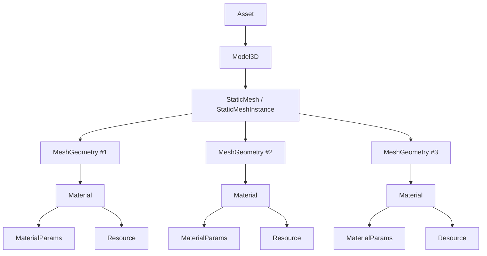
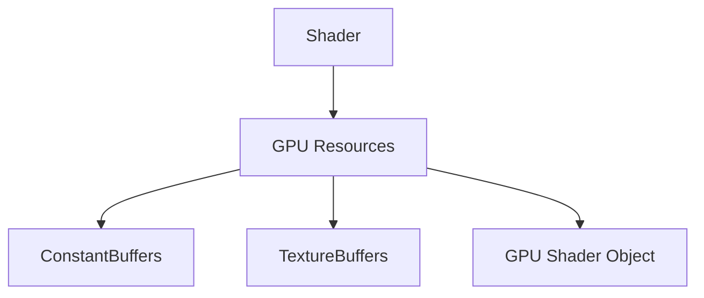

# Materials, Meshes & Shaders

This page covers the engine-side asset representation that sits between a burned `.meshasset`/`.materialasset` file on disk ([Asset-Burning-Pipeline.md](../05-AssetPipeline/Asset-Burning-Pipeline.md)) and the GPU handles consumed by `Rendering::Renderer` ([Low-Level-Renderer-Module.md](Low-Level-Renderer-Module.md)).

## Asset representation hierarchy (reproduced from `DrawIO\AssetRepresentation_March2021.drawio`)

A `StaticMeshInstance` is a named collection of `MeshGeometry` sub-meshes (one per Assimp mesh node at import time); each sub-mesh owns exactly one `MaterialInstance`, and each material owns its own `MaterialParams` plus texture resource(s).

## Shader GPU resource grouping (reproduced from page 2 of the same `.drawio`)

## `MeshGeometry` (`Engine\Src\Graphics\MeshGeometry.h` / `.cpp`)

Per-submesh geometry: `MeshVertex { Position, Normal, Tangent, UVData }`, plus vertex/index arrays and their GPU-side `VertexBuffer`/`IndexBuffer` (`shared_ptr`), and an associated `MaterialInstance`.

## `StaticMeshInstance` (`Engine\Src\Graphics\StaticMeshInstance.h` / `.cpp`)

A named collection of `MeshGeometry` sub-meshes — this is the in-memory "asset" a `RenderObject` references. Loaded/populated via `StaticMeshResource` ([Asset-Import-Runtime.md](../05-AssetPipeline/Asset-Import-Runtime.md)).

## `MaterialInstance` (`Engine\Src\Graphics\Material.h` / `.cpp`)

Holds: name, texture slots (`DIFFUSE`/`SPECULAR`/`NORMAL` — matching the render-decomposition diagram's `DiffuseBuffer`/`SpecularBuffer`/`NormalBuffer` and `AssimpSourceImporter`'s `ETextureFlags`), `MaterialParams { Shininess, Opacity }`, a shader-technique resource handle, and a GPU constant buffer for material params. Built from `MaterialAssetImporter::MaterialData`.

## `Shader` / `Texture2D` / `VertexBuffer` / `IndexBuffer` (`Engine\Src\Graphics\`)

Thin engine-side `IResource` wrappers around the lower-level GPU objects exposed by `Modules\Rendering` (`Rendering::VertexShaderHandle`/`PixelShaderHandle`, `Rendering::TextureBuffer2DHandle`, `Rendering::VertexBufferHandle`/`IndexBufferHandle`). These are what `ResourceHandler` loads/caches by file path.

## Key files

- `Engine\Src\Graphics\MeshGeometry.h/.cpp`
- `Engine\Src\Graphics\StaticMeshInstance.h/.cpp`
- `Engine\Src\Graphics\Material.h/.cpp`
- `Engine\Src\Graphics\Shader.h/.cpp`, `Texture2D.h/.cpp`, `VertexBuffer.h/.cpp`, `IndexBuffer.h/.cpp`
- `Engine\Src\Game\World\GameObjectComponents\StaticMeshResource.h/.cpp`
