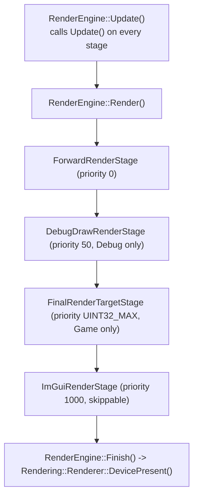

# Render Stages

`RenderEngine` executes a priority-ordered list of `IRenderStage` implementations each frame — a lightweight, non-data-driven "render graph." This is the mechanism by which RZE composes a frame out of independent passes.

## The interface

```cpp
// Engine\Src\Graphics\RenderStage.h
class IRenderStage {
public:
    virtual void Initialize() = 0;
    virtual void Update(const RenderCamera& camera, const RenderEngine::SceneData& renderData) = 0;
    virtual void Render(const RenderCamera& camera, const RenderEngine::SceneData& renderData) = 0;
    virtual U32 GetPriority() = 0;
};
```

Stages are stored in `RenderEngine::m_renderStages` (`std::vector<std::unique_ptr<IRenderStage>>`), kept sorted ascending by `GetPriority()`. Every stage gets `Update()` called every frame (`RenderEngine::Update()`), then every stage gets `Render()` called in priority order during `RenderEngine::Render()`.

## Concrete stages (`Engine\Src\Graphics\RenderStages\`)

| Stage | Priority | Active in | Purpose |
|---|---|---|---|
| `ForwardRenderStage` | 0 | Always | The main forward-rendering pass — draws every `RenderObject` in the scene's `RenderObjectContainer` using its vertex/pixel shaders. |
| `DebugDrawRenderStage` | 50 | Debug builds only | Draws the queued `DebugLineContainer` (from `RenderEngine::DrawLine()`) with dedicated debug-line vertex/pixel shaders. |
| `FinalRenderTargetStage` | `UINT32_MAX` (last) | `GameApp` only | Blits/finalizes the rendered frame to the actual back buffer/swap chain. The Editor never adds this stage — its output stays in an off-screen RTT consumed by ImGui instead. |
| `ImGuiRenderStage` | 1000 | Both, but skippable | Issues the ImGui draw call. `RenderEngine::Render(..., withImgui)` skips this stage when `withImgui` is false. |

## Ordering diagram



## Why priority ordering matters here

- `ForwardRenderStage` must run first so there's a populated colour/depth buffer for later passes to build on.
- `FinalRenderTargetStage` runs at `UINT32_MAX` specifically because it must be the very last pass that touches the swap chain before present — nothing else should draw after the "final" blit.
- `ImGuiRenderStage` at priority 1000 sits after the final blit but before present, so ImGui always draws on top of the finished frame (both the game's debug overlays and, in the Editor, the entire UI).

## Adding a new stage

`RenderEngine::AddRenderStage<TRenderStageType>(args...)` is the only entry point — it constructs the stage and inserts it in priority order. There's no way to remove or reorder stages after `Initialize()`/an app's `Initialize()` call adds them; the stage list is effectively static for the lifetime of the app.

## Key files

- `Engine\Src\Graphics\RenderStage.h`
- `Engine\Src\Graphics\RenderStages\ForwardRenderStage.h/.cpp`
- `Engine\Src\Graphics\RenderStages\DebugDrawRenderStage.h/.cpp`
- `Engine\Src\Graphics\RenderStages\FinalRenderTargetStage.h/.cpp`
- `Engine\Src\Graphics\RenderStages\ImGuiRenderStage.h/.cpp`
