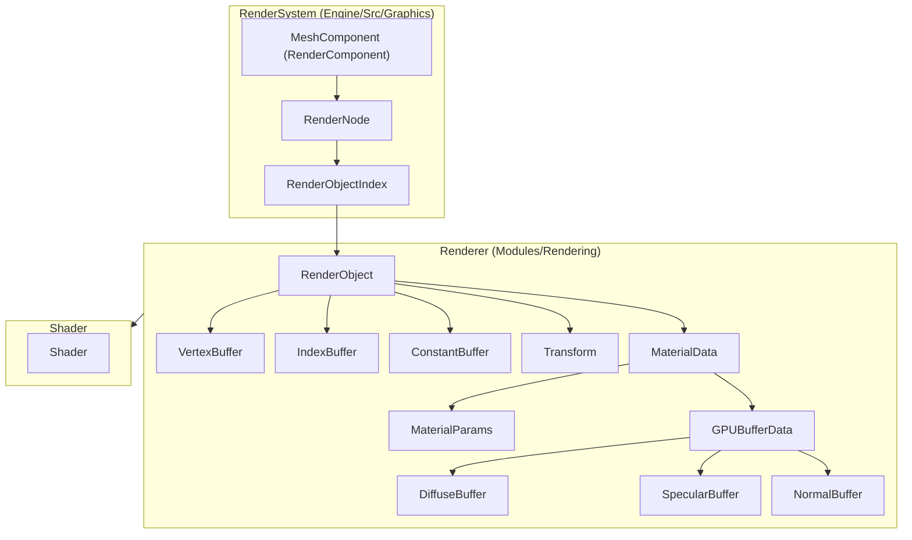

# Rendering: Overview & Design Philosophy

RZE's rendering is deliberately split into two named layers, described directly in the engine's own design notes (`Docs\RenderSystemThoughts.txt`, `Docs\Render_Architexture_2020.txt`, dated 2020) as **RenderSystem** vs **Renderer**:

> "RenderSystem" is conventionally what people mean by "a rendering engine" — it uses composition to prepare the scene (culling, pass management/population) and submits render commands that determine per-frame render state. "Renderer" is written with intimate knowledge of the hardware API; its sole job is to organize/issue draw calls to the GPU as fast as possible, exploiting hardware-specific nuances.

In the actual codebase, this maps to:

| Design-doc term | Actual code | Lives in |
|---|---|---|
| RenderSystem | `RenderEngine` + `IRenderStage` pipeline | `Engine\Src\Graphics\` |
| Renderer (called "Diotima" in one internal note) | `Rendering::Renderer` + `RenderThread` | `Modules\Rendering\` |
| Driver API | `Rendering::DX11Device` and friends | `Modules\Rendering\Src\Rendering\Driver\DX11\` |

The 2020 notes list RenderSystem's intended responsibilities as: maintaining scene-graph state from component add/remove/modify, **bucketing** RenderObjects into passes (e.g. shadow casters), **culling** to viewport-relevant objects, and communicating creation/update requests to the Renderer. Culling and bucketing are aspirational in the notes — the current `RenderEngine` sends its entire scene to each stage every frame with no culling pass implemented yet (see [10-KnownIssues](../10-KnownIssues/Architectural-Notes-And-TODOs.md)).

## Layered decomposition (reproduced from `DrawIO\Render_Decomposition_March2021.drawio`)

This mirrors the diffuse/specular/normal texture-slot scheme actually implemented in `MaterialInstance` ([Materials-Meshes-Shaders.md](Materials-Meshes-Shaders.md)) and in `AssimpSourceImporter`'s `ETextureFlags` ([Asset-Burning-Pipeline.md](../05-AssetPipeline/Asset-Burning-Pipeline.md)) — this diagram was a design sketch that the current implementation substantially follows.

## The three-tier summary from `Render_Architexture_2020.txt`

1. **Game/Engine Features** — organizes/manages the "what, why, how" of visual data; works out render work to submit and in what order (this is `RenderEngine` + `IRenderStage`s today).
2. **Renderer** ("Diotima") — a thin wrapper against the GPU; organizes data so it's ready to upload at draw time; submits to the GPU (this is `Rendering::Renderer` + `RenderThread` today).
3. **Driver API** — buffers, state, driver debugging/validation (this is `Rendering::Driver::DX11` today).

The same notes end on an open question that is still relevant when reading the current code: *"Should we build the render data every frame — hold buffer state?"* — worth keeping in mind when reading [Low-Level-Renderer-Module.md](Low-Level-Renderer-Module.md), where per-frame `RenderCommand` submission is in fact the chosen approach.

## Read next

- [Engine-Graphics-Layer.md](Engine-Graphics-Layer.md) — `RenderEngine`, `RenderObject`/`LightObject`/`RenderCamera`
- [Render-Stages.md](Render-Stages.md) — the `IRenderStage` pipeline
- [Materials-Meshes-Shaders.md](Materials-Meshes-Shaders.md) — asset representation hierarchy
- [Low-Level-Renderer-Module.md](Low-Level-Renderer-Module.md) — the command-buffer render thread and DX11 driver layer
