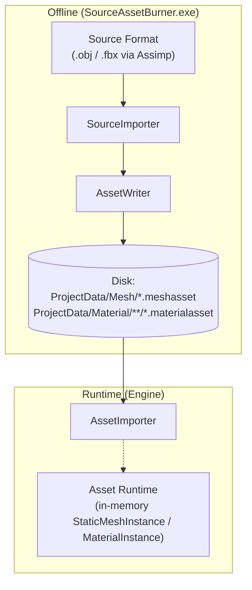

# Asset Burning Pipeline

RZE never loads `.obj`/`.fbx` source models at runtime. Instead, a separate offline tool — **SourceAssetBurner** — converts human-authored "source" assets into RZE's own binary runtime formats ahead of time. This offline conversion step is literally called "burning" in the tooling (README: "Burn Assets" button in RZEHub).

## Offline vs runtime, reproduced from `DrawIO\AssetBurnAndConditionPipeline.drawio`



Raw **Source Format** files are processed offline by a **SourceImporter** (concretely, `AssimpSourceImporter`) via an **AssetWriter** (`MeshAssetWriter` / hand-rolled material writer) into a persisted **Asset** file on **Disk**. At runtime, an **AssetImporter** reads that file back into the in-memory **Asset Runtime** representation. The two halves never share code paths at execution time — only the binary format is shared.

## `SourceAssetBurner` (its own exe project, `SourceAssetBurner\SourceAssetBurner.sharpmake.cs`, depends on `Engine` — which transitively brings in `Utils`, `Externals`, `Rendering` — links Assimp)

Entry point `SourceAssetBurner\Src\SourceAssetBurner\SourceAssetBurnerMain.cpp`:
- Sets `Filepath::SetDirectoryContext(EDirectoryContext::Tools)` — this is what makes relative asset paths resolve correctly when run as a standalone tool rather than the runtime game (see `Filepath` in [Utils-Library-Reference.md](../06-Platform-And-Infrastructure/Utils-Library-Reference.md)).
- With no CLI argument: recursively walks `Assets\3D\` for every `.obj` and imports each one ("Troll Assets/3D and BURN IT ALL" — source comment).
- With a CLI argument: treats it as a single source file path to import.

`Importers\SourceImporter.h` — abstract interface `virtual bool Import(const Filepath&) = 0;`, designed so other source formats could be added later (only Assimp is implemented today).

`Importers\AssimpSourceImporter.h/.cpp` — the only concrete importer:
- Loads via `Assimp::Importer::ReadFile` with flags `aiProcessPreset_TargetRealtime_Fast | (aiProcess_ConvertToLeftHanded ^ aiProcess_FlipWindingOrder) | aiProcess_OptimizeMeshes | aiProcess_OptimizeGraph`.
- Walks the Assimp node graph (`ProcessNode`/`ProcessMesh`), extracting per-vertex position/normal/UV/tangent data and index buffers into `MeshData`.
- Extracts material data (shininess, opacity, diffuse/specular/normal texture paths) into an internal `MaterialData`, with an `ETextureFlags` bitmask (`ALBEDO`/`SPECULAR`/`NORMAL`) — matching the texture slots on `MaterialInstance` ([Materials-Meshes-Shaders.md](../04-Rendering/Materials-Meshes-Shaders.md)).
- Deduplicates materials in `m_materialTable`, keyed by output path.
- `WriteMeshAsset()` delegates to the Engine's `MeshAssetWriter` (see below).
- `WriteMaterialAsset()` hand-rolls binary serialization via `ByteStream` directly to `ProjectData\Material\<AssetName>\<MaterialName>.materialasset` — a `#TODO` comment notes JSON was tried first but produced files too large/uncompressed.
- `WriteTextureAsset()` is currently a stub returning `false` — texture "burning" (compression/packing) isn't implemented; textures are referenced by relative path back into `Assets\` rather than converted.

## The binary mesh format

Defined engine-side at `Engine\Src\Asset\AssetImport\MeshAssetWriter.h/.cpp`:

```
MeshAssetFileHeader { uint16_t AssetVersion; size_t BufSize; size_t MeshCount; }
per mesh:
    name length + bytes
    material-path length + bytes
    vertex-data length + raw MeshVertex array bytes
    index-data length + raw U32 array bytes
```

Written via `ByteStream`/`File` (`Utils\Memory\ByteStream.h`, `Utils\Platform\File.h`). `AssetWriter` (`Engine\Src\Asset\AssetImport\AssetWriter.h`) is the common base; `MeshAssetWriter : public AssetWriter`.

## Output layout

- `ProjectData\Mesh\*.meshasset`
- `ProjectData\Material\<ModelName>\*.materialasset`

One folder per source model — these binary files already exist checked into the repo for: Cube, FW190, Hangar, Mountain, Nanosuit, NeckMechWalker, Nyra, Panzer, Quad, Spaceship, sponza, M4A1 — matching the raw source models in `Assets\3D`. This is effectively the "cooked asset" directory, parallel to raw `Assets\`.

## Where this fits in the full build flow

See [Building-And-Running.md](../01-GettingStarted/Building-And-Running.md) — burning is step 3 of 5 in the canonical build sequence (generate solution → compile → **burn assets** → copy assets → run).

## Key files

- `SourceAssetBurner\Src\SourceAssetBurner\SourceAssetBurnerMain.cpp`
- `SourceAssetBurner\Src\SourceAssetBurner\Importers\SourceImporter.h`, `AssimpSourceImporter.h/.cpp`
- `Engine\Src\Asset\AssetImport\AssetWriter.h`, `MeshAssetWriter.h/.cpp`
- `ProjectData\Mesh\`, `ProjectData\Material\`
