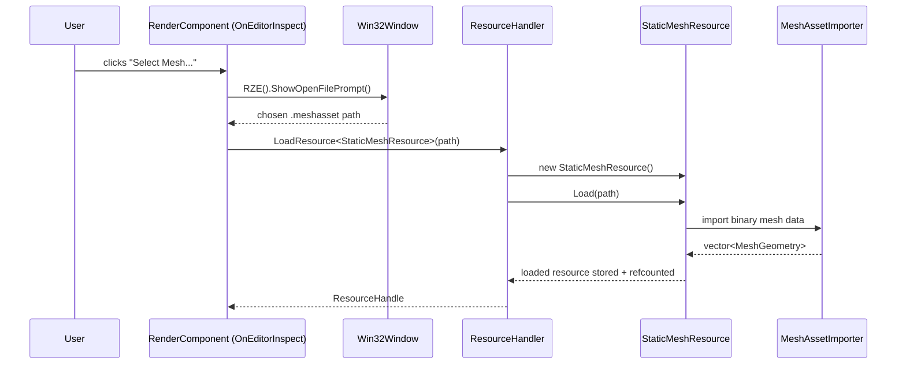

# Runtime Asset Import & Resource Loading

This page covers how a burned `.meshasset`/`.materialasset` file (produced offline — see [Asset-Burning-Pipeline.md](Asset-Burning-Pipeline.md)) gets loaded back into memory at runtime, and how `ResourceHandler` manages the lifetime of loaded assets in general.

## `Engine\Src\Asset\AssetImport\` — the runtime-facing import layer

- `AssetImporter.h` — interface: `virtual bool Import(const Filepath&) = 0;`
- `MeshAssetImporter.h/.cpp` — reads the `.meshasset` binary format (see [Asset-Burning-Pipeline.md](Asset-Burning-Pipeline.md) for the exact byte layout) back into `std::vector<MeshGeometry>`.
- `MaterialAssetImporter.h/.cpp` — reads `.materialasset` files into a `MaterialData` struct, later consumed by `MaterialInstance::Create`.
- `AssetWriter.h`, `MeshAssetWriter.h/.cpp` — the writer side, shared with `SourceAssetBurner` (documented in [Asset-Burning-Pipeline.md](Asset-Burning-Pipeline.md)).

## `StaticMeshResource` (`Engine\Src\Game\World\GameObjectComponents\StaticMeshResource.h/.cpp`)

An `IResource` subclass wrapping a `StaticMeshInstance`. `Load(filePath)` deserializes the `.meshasset` binary format via `MeshAssetImporter`. Exposes `GetStaticMesh()`/`GetInstance()`. This is the type `RenderComponent` and `ResourceHandler::LoadResource<StaticMeshResource>()` operate on.

## `ResourceHandler` (`Engine\Src\EngineCore\Resources\ResourceHandler.h/.cpp`)

The central, reference-counted resource/asset manager:

```cpp
template <typename ResourceT, typename... Args>
ResourceHandle LoadResource(const Filepath& path, Args... args);

template <typename ResourceT>
ResourceT& GetResource(const ResourceHandle& handle);

void ReleaseResource(ResourceHandle& handle);
```

Internally: a private nested `ResourceSource` wraps `IResource*` + a reference count + the originating `Filepath`. Resources are keyed by a string derived from the file path (`Conversions::CreateResourceKeyFromPath`) in `mResourceTable` (`std::unordered_map<std::string, ResourceSource>`). `LoadResource` checks the table first; if not already loaded, it constructs `new ResourceT(args...)`, calls `resource->Load(path)`, stores it, and returns a `ResourceHandle`. `GetResource<ResourceT>` does a `static_cast` to the requested type with no vtable-based type check — callers must request the correct type themselves.

`ResourceHandle` is a move-only (copy-disabled), RAII-ish handle referencing a `ResourceSource*`, friended to `ResourceHandler`.

Used today for: `EngineConfig`, `StaticMeshResource`, `Texture2D`, `Shader` (vertex/pixel), `MaterialInstance`-adjacent assets.

`IResource` itself is defined in `Utils\Src\Utils\Interfaces\Resource.h` (outside Engine, in the foundational Utils library): `virtual bool Load(const Filepath&)`, `virtual void Release()`, plus a texture-specific overload `virtual bool Load(const U8* buffer, int width, int height)` (flagged as "gross" in its own source comment).

## Loading is synchronous today

`ResourceHandler` performs a synchronous `resource->Load(path)` call — there's no async/streaming path, and loading isn't currently routed through the `Threading::JobScheduler` job system ([Threading-And-Jobs.md](../06-Platform-And-Infrastructure/Threading-And-Jobs.md)) despite that system existing. Worth knowing if you're chasing a load-time stall.

## Sequence: a `RenderComponent` requesting a mesh via the editor's "Select Mesh..." workflow



## Key files

- `Engine\Src\Asset\AssetImport\AssetImporter.h`, `MeshAssetImporter.h/.cpp`, `MaterialAssetImporter.h/.cpp`
- `Engine\Src\Game\World\GameObjectComponents\StaticMeshResource.h/.cpp`
- `Engine\Src\EngineCore\Resources\ResourceHandler.h/.cpp`
- `Utils\Src\Utils\Interfaces\Resource.h`
