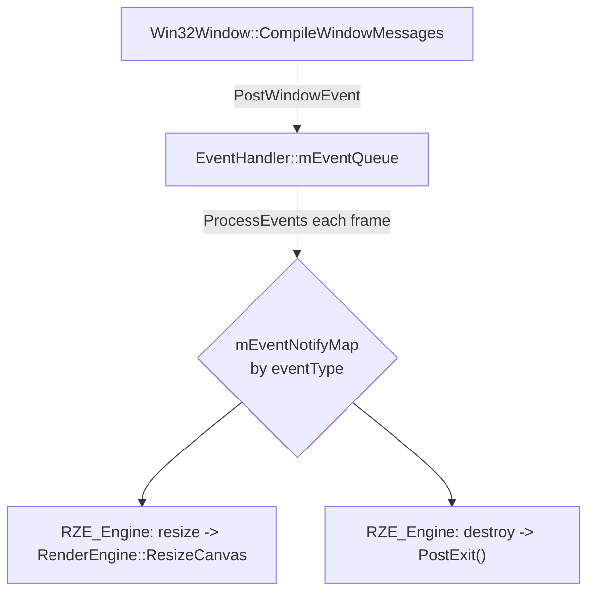

# Event System

`Engine\Src\Events\` implements a generic, engine-wide publish/subscribe event bus — distinct from `InputHandler`'s action-binding model ([Input-System.md](Input-System.md)), though both are ultimately fed by the same Win32 message pump via `Win32Window`.

## Types

- `EventTypes.h` — `EEventType` enum (window/key/mouse categories) and `EWindowEventType` (e.g. `Window_Destroy`, `Window_Resize`).
- `Events.h` — POD event structs: `EventInfo` (type + subtype), `WindowEvent` (+ size), `KeyEvent` (+ key), `MouseEvent` (+ position), combined into a tagged-union-style `Event` struct:
  ```cpp
  struct Event {
      union { EventInfo mInfo; WindowEvent mWindowEvent; KeyEvent mKeyEvent; MouseEvent mMouseEvent; };
  };
  ```
  — a compact representation for a heterogeneous event queue.

## `EventHandler`

A classic pub/sub bus: `mEventQueue` (`std::queue<Event>`) plus `mEventNotifyMap` (`std::map<U16 eventType, std::vector<EventHandlingInfo>>`, where `EventHandlingInfo = { Event, Functor<void, const Event&> }`).

API:
```cpp
void PostWindowEvent(...) / PostKeyEvent(...) / PostMouseEvent(...);  // optionally fire immediately
void RegisterForEvent(eventType, callback);
void ProcessEvents();                                                 // drains queue, dispatches by type
```

## What it's used for today

Primarily window lifecycle notifications: `RZE_Engine::RegisterWindowEvents()` subscribes to `EEventType::Window` so the engine can react to resize (`RenderEngine::ResizeCanvas`) and destroy (`PostExit()`) without those call sites needing to know about `Win32Window` internals directly.

## Diagram



## Key files

- `Engine\Src\Events\EventTypes.h`
- `Engine\Src\Events\Events.h`
- `Engine\Src\Events\EventHandler.h/.cpp`
