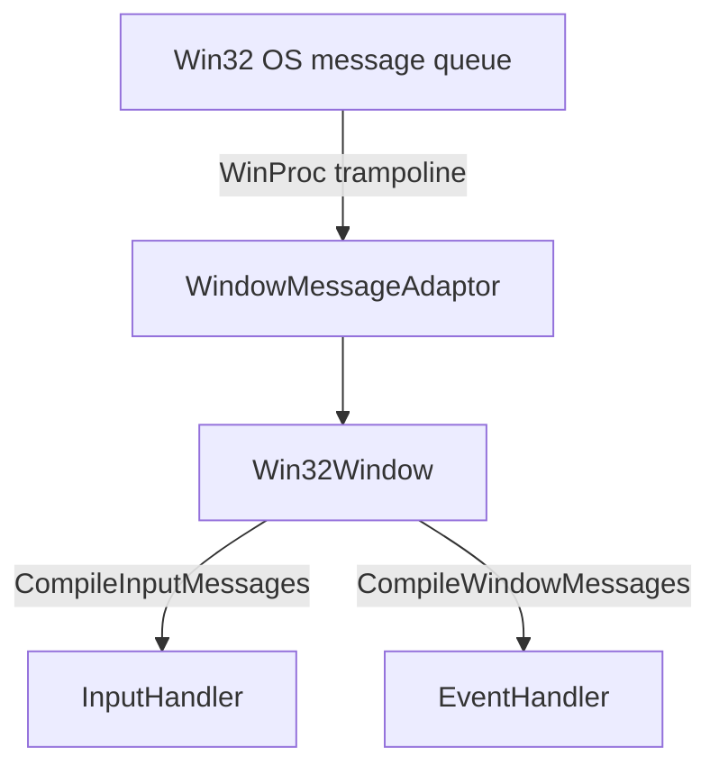

# Windowing / Win32 Platform Layer

`Engine\Src\Windowing\` is RZE's Win32 platform abstraction — the only OS layer supported today (no macOS/Linux path exists; see [09-BuildSystem](../09-BuildSystem/Sharpmake-Project-Graph.md), where non-Windows target platforms are commented out in the Sharpmake config).

## `Win32Window` (`Win32Window.h/.cpp`)

Wraps `HWND`/`HDC`/`HGLRC`/`PIXELFORMATDESCRIPTOR` in an `OSWindowHandleData` struct. Responsibilities:
- Window creation (`Create`), show/maximize, cursor control, title/size get/set.
- Native Open/Save file dialogs (`ShowOpenFilePrompt`/`ShowSaveFilePrompt`) — surfaced up through `RZE().ShowOpenFilePrompt()`.
- **`CompileInputMessages(InputHandler&)`** / **`CompileWindowMessages(EventHandler&)`** — pumps the Win32 message queue once per frame and translates messages into `InputHandler`/`EventHandler` calls via `ProcessWinProcMessage`. This is the single point where all OS input/window events enter the engine.

## `WindowMessageAdaptor` (`WindowMessageAdaptor.h/.cpp`)

An intermediary queue (`EMessageType`: `Create`/`Move`/`Resize`/`Destroy`/`Close`/`Quit`) that decouples the raw WinProc callback — which must be a static/global function per the Win32 API — from the `Win32Window` instance. Messages get pushed from the WinProc trampoline and later popped/processed by `Win32Window`, avoiding the need for global mutable window state at the WinProc callback site.

## `WinKeyCodes.h`

Win32 virtual-key-code constants and mapping (`Win32KeyCode`), used by `InputHandler` to translate WM_KEYDOWN/WM_KEYUP messages into engine `InputKey` values.

## Diagram

## Key files

- `Engine\Src\Windowing\Win32Window.h/.cpp`
- `Engine\Src\Windowing\WindowMessageAdaptor.h/.cpp`
- `Engine\Src\Windowing\WinKeyCodes.h`
