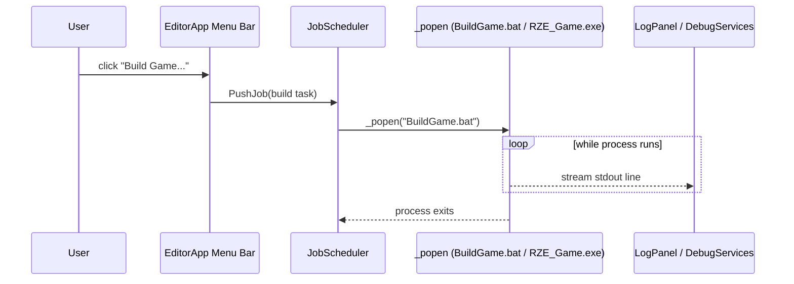

# Editor Camera & Build/Launch Workflow

## `EditorCameraComponent` (`Editor\Src\Game\World\GameObjectComponents\EditorCameraComponent.h/.cpp`)

`final class EditorCameraComponent : public GameObjectComponent<EditorCameraComponent>` — a free-fly, "Unreal-style" viewport camera used only by the Editor (never registered in Game builds).

- Registers itself as a reflection child of `CameraComponent` via `REFLECT_REGISTER_COMPONENT_CHILD(EditorCameraComponent, CameraComponent)` in its constructor — this uses the *separate* `Utils\Reflect\ReflectDB` system, purely for editor inspector sort-ordering. It does **not** fix the underlying component-ID collision between `CameraComponent` and `EditorCameraComponent` described in [Component-System.md](../03-SceneAndGameObjects/Component-System.md) — that limitation is documented directly in `GameObjectComponent.h` and remains a known issue (see [10-KnownIssues](../10-KnownIssues/Architectural-Notes-And-TODOs.md)).
- State: `m_lookAt`/`m_upDir`/`m_forward` vectors, `m_projectionMat`/`m_viewMat`, FOV/aspect/near/far, `m_speed`, a speed-ramp system (`kMinDirectionHeldTime`/`kMaxDirectionHeldTime` — holding a direction key ramps speed up to 10x the longer it's held), mouse yaw/pitch accumulation.
- **`Update()`** — if this is the active camera: reads the sibling `TransformComponent`, processes keyboard/mouse input, regenerates view/projection matrices, then pushes `Position`/`ClipSpace` (`proj * view`) into `RZE().GetRenderEngine().GetCamera()`.
- **`KeyboardInput`** — WASD movement in the forward/right plane (right = forward × up); E/Q for vertical movement (a double cross-product to derive a true "up" relative to the camera); R = 4x speed boost; Space = 1/8 speed ("slow-mo"); mouse wheel dollies along forward.
- **`MouseInput`** — only active while the **right mouse button is held** (an FPS-camera-in-editor convention); computes mouse delta → yaw/pitch accumulation (0.1 sensitivity) → new forward vector via spherical coordinates.

### Engine coupling

Heavy — includes `EngineApp.h`, `GameObject.h`, `GameObjectComponent.h`, `CameraComponent.h`, `RenderComponent.h`, `TransformComponent.h` (Engine); `RenderEngine.h`, `ImGuiRenderStage.h` (Engine\Graphics); `JobScheduler.h`, `DebugServices.h` (Engine infra); `Rendering\Renderer.h`, `Rendering\MemArena.h`, `Rendering\Graphics\RenderTarget.h` (Modules\Rendering); plus `ImGui`/`ImGuizmo`/`Optick` third-party headers. In practice the Editor camera is just another `GameObjectComponent` exercising the same public APIs any gameplay component would use — it isn't a privileged, engine-internal type.

## Build/Launch workflow

`EditorApp::DisplayMenuBar()` includes "Build Game..." and "Launch Game..." menu items. Selecting one pushes a `Threading::Job::Task` onto `Threading::JobScheduler::Get()` ([Threading-And-Jobs.md](../06-Platform-And-Infrastructure/Threading-And-Jobs.md)), which shells out via `_popen`:
- **Build Game** → `BuildGame.bat` (which runs `msbuild _Project\Game.vcxproj -property:Configuration=Debug -property:Platform=x64`)
- **Launch Game** → `_Build\Debug\x64\RZE_Game.exe`

Output is streamed line-by-line into the `LogPanel` via `DebugServices`, so build errors/output show up live in the Editor's log console rather than in a separate terminal window.

This effectively makes the Editor double as a lightweight build/launch orchestrator for the Game executable, in addition to its scene-authoring role. The menu bar also shows live frame time and the `Rendering::MemArena` pressure readout (LOW/MED/HIGH, color-coded, current/peak KB/MB) described in [Low-Level-Renderer-Module.md](../04-Rendering/Low-Level-Renderer-Module.md).

## Key files

- `Editor\Src\Game\World\GameObjectComponents\EditorCameraComponent.h/.cpp`
- `Editor\Src\EditorApp.cpp` — `DisplayMenuBar()`
- `BuildGame.bat`
