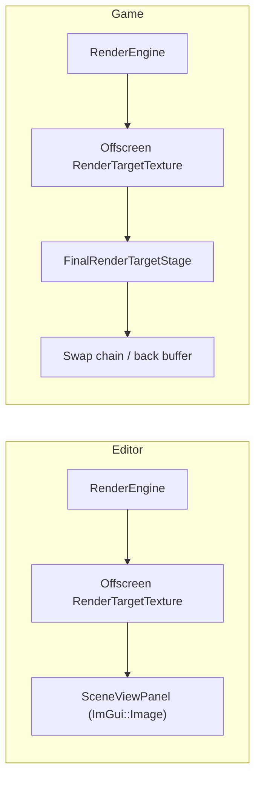

# Editor Overview

The Editor (`RZE\Editor\`, project name in some contexts "RZEStudio") is a Dear ImGui–based standalone application for authoring scenes: an ImGui dockspace hosting scene-tree, 3D viewport, log, and resource-monitor panels, plus scene load/save and a build/launch pipeline. It is a specialized `RZE_Application` subclass (see [App-Shell-Pattern.md](../02-Architecture/App-Shell-Pattern.md)) — it does not have its own renderer or scene model; it uses the exact same `Engine`/`Modules\Rendering` stack the Game uses.

## Entry point

`Editor\Src\EditorMain.cpp` — `main()` sets `Filepath::SetDirectoryContext(EDirectoryContext::Tools)` (so relative asset paths resolve against the tools/editor working context, not the runtime game context — see [Utils-Library-Reference.md](../06-Platform-And-Infrastructure/Utils-Library-Reference.md)), constructs `Editor::EditorApp`, forwards CLI args, calls `Run()`.

## `EditorApp` (`Editor\Src\EditorApp.h/.cpp`)

Members: `LogPanel m_logPanel`, `ScenePanel m_scenePanel`, `SceneViewPanel m_sceneViewPanel`, `ResourceMonitorPanel m_resourceMonitor`, a font map (`std::unordered_map<std::string, ImFont*>`), `GameObjectPtr m_editorCameraObject`, `Filepath m_imguiConfigFilepath`.

### Lifecycle

- **`Initialize()`** — calls the base class implementation, registers an `ImGuiRenderStage` on `RZE().GetRenderEngine()` (with `isWithEditor=true`), points ImGui's ini file at `Config\imgui.ini`, creates the offscreen render target sized to the client window, sets docking flags, loads fonts from `Assets\Fonts\*.ttf/.otf`, and applies a dark ImGui style.
- **`Start()`** — resolves which scene to load: the `-scene` CLI arg if present, else the hard-coded fallback `Assets\Scenes\RenderTest.scene` (called out as "a hack" in a source comment — the same fallback `GameApp` uses), then calls `LoadScene()` and updates the window title.
- **`Update()`** — draws the full-screen ImGui dockspace (`NoDocking|NoTitleBar|...` flags), the menu bar, then dispatches to each panel via `ResolvePanelState()`.
- **`ProcessInput`** — manually feeds mouse/keyboard state into ImGui's `io.MousePos`/`MouseDown`/`KeysDown` (no native ImGui backend hookup on the input side), and returns whether the `SceneViewPanel` is hovered — this is the "steal input" hook described in [Input-System.md](../06-Platform-And-Infrastructure/Input-System.md).
- **`OnWindowResize`** — recreates the render target and reassigns it to `RZE().GetRenderEngine()`.

### The offscreen viewport

**`CreateRenderTarget`** builds a `Rendering::RenderTargetTexture` sized to the passed dimensions. This is the key difference from `GameApp`: the Editor never presents directly to the OS window's back buffer — its render output stays in this offscreen texture, which `SceneViewPanel` then displays inside an ImGui window via `ImGui::Image()`. The Editor's viewport is genuinely rendered-to-texture, not a special editor-only render path.

### Editor camera

**`CreateAndInitializeEditorCamera()`** creates a `GameObject` named `"EditorCam"`, adds a `TransformComponent` (positioned at `(-4, 10, 4)`) and an `EditorCameraComponent` (`SetAsActiveCamera(true)`, aspect ratio taken from the `SceneViewPanel`'s current dimensions). See [Editor-Camera-And-Build-Launch.md](Editor-Camera-And-Build-Launch.md).

### Scene load/save

**`LoadScene(const Filepath&)`** — resets selection state, `RZE().GetActiveScene().Unload()`, then either `NewScene()` or `Deserialize(filepath)`, then re-creates the editor camera. The camera is deliberately **not** part of saved scene state: `EditorCameraComponent::Initialize()` calls `GetOwner()->SetIncludeInSave(false)`.

## Diagram: Editor vs Game render target destination

## Key files

- `Editor\Src\EditorMain.cpp`
- `Editor\Src\EditorApp.h/.cpp`
- `Editor\Src\UI\Panels\` — see [Editor-Panels.md](Editor-Panels.md)
- `Editor\Src\Game\World\GameObjectComponents\EditorCameraComponent.h/.cpp` — see [Editor-Camera-And-Build-Launch.md](Editor-Camera-And-Build-Launch.md)
