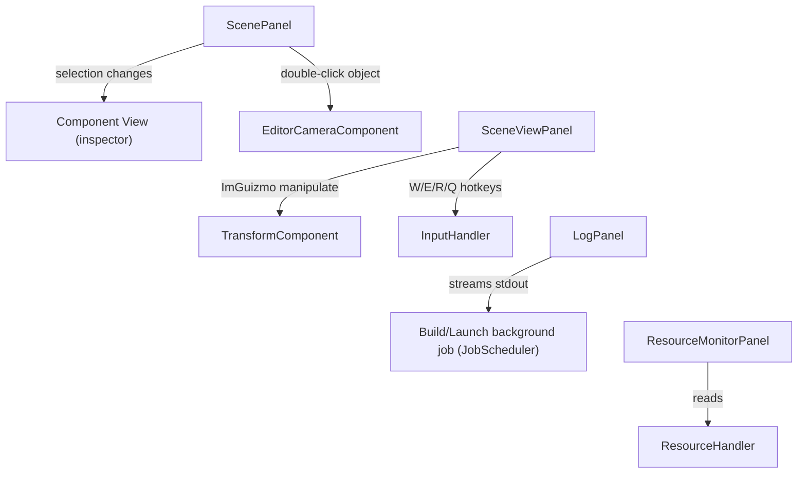

# Editor Panels

All Editor UI panels live under `Editor\Src\UI\Panels\`.

## `ScenePanel` (`ScenePanel.h/.cpp`)

Two ImGui windows:

**"Scene"** — a hierarchy tree of root `GameObject`s (excluding the editor-camera object). Features:
- Right-click "Create GameObject" with an inline name-entry popup → `RZE().GetActiveScene().AddGameObject(name)`.
- Recursive `DisplayObject()` renders each GameObject as an `ImGui::TreeNodeEx`; click selects it (stored as `SelectedItem { GameObjectPtr, bool isDirty }`); double-click re-aims the editor camera at the object (computes a new forward vector from camera-to-object).
- Drag-and-drop re-parenting via `ImGui::BeginDragDropSource`/`Target` with payload `"DraggedObjectName"`, calling `DetachFromParent()`/`AttachTo()`.
- Context menu: Rename, "Add Component" (enumerates `GameObjectComponentRegistry::GetAllComponentReflectData()` and calls `gameObject->AddComponentByID(componentID)`), Detach From Parent, Delete.

**"Component View"** — the inspector for the currently-selected object's components. Sorts the selected object's `GameObjectComponentBase*` list by `EditorComponentCache::GetAllComponentsInfo()[id].Order` (falls back to `kDefaultSortingOrder = 0x0100` if unspecified), then calls each component's virtual `OnEditorInspect()` in that order.

## `SceneViewPanel` (`SceneViewPanel.h/.cpp`)

The 3D viewport window ("SceneView"). Owns `TransformGizmoState { currentOpMode, transformationSpace }`, driving an embedded **ImGuizmo** translate/rotate/scale toolbar with local/world space toggle.

- On resize: updates `RZE().GetRenderEngine().SetViewportSize()` and the editor camera's aspect ratio.
- Renders the offscreen `RenderTargetTexture` via `ImGui::Image()`, reading `pRTT->GetTargetPlatformObject().GetTextureData()`, with UV coordinates clamped to the visible viewport fraction (handles the case where the RTT's actual size and the ImGui window's displayed size don't match exactly).
- Drives ImGuizmo's `Manipulate()`/matrix decomposition to write back into the selected object's `TransformComponent` (position/rotation/scale) whenever the gizmo is manipulated.
- Registers **W/E/R/Q** hotkeys directly with the global `InputHandler` (translate / rotate / scale / toggle local-world space).

## `LogPanel` (`LogPanel.h/.cpp`)

A thin console/log panel — public API is just `Display()` and `AddEntry(msg)`, backed by an internal deque of strings. This is what streams stdout from the Editor's "Build Game..."/"Launch Game..." background jobs (see [Editor-Camera-And-Build-Launch.md](Editor-Camera-And-Build-Launch.md)) and general `DebugServices`/`RZE_LOG` output.

## `ResourceMonitorPanel` (`ResourceMonitorPanel.h/.cpp`)

A toggleable panel (public `IsEnabled` bool, driven directly by an ImGui checkbox) for resource/asset statistics.

## Diagram: panel interactions

## Key files

- `Editor\Src\UI\Panels\ScenePanel.h/.cpp`
- `Editor\Src\UI\Panels\SceneViewPanel.h/.cpp`
- `Editor\Src\UI\Panels\LogPanel.h/.cpp`
- `Editor\Src\UI\Panels\ResourceMonitorPanel.h/.cpp`
