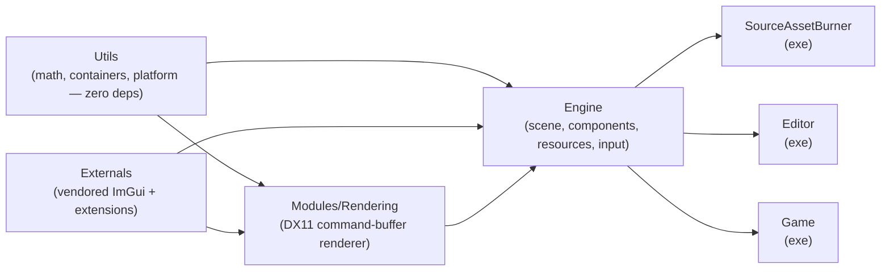

# RZE Engine Knowledgebase

RZE is a custom C++ game engine built with a hand-rolled entity/component scene model, a command-buffer DirectX 11 renderer running on its own thread, and an offline "asset burning" content pipeline. This knowledgebase documents how it works, organized by system.

This documentation is generated from a point-in-time read of the codebase. File paths are given relative to `C:\dev\RZE\RZE\` unless stated otherwise. When code and docs disagree, trust the code — grep the cited path to confirm before relying on a claim here.

## How the repo is laid out

```
RZE/                    (repo root, C:\dev\RZE)
  RZE/                  (all source + build config)
    Engine/              — core engine library (this is the "Engine" module, not this knowledgebase)
    Modules/Rendering/   — low-level DX11 renderer, independent of Engine
    Editor/              — level/scene editor application (exe)
    Game/                — shippable game application (exe)
    Utils/               — foundational library (math, containers, platform, no engine deps)
    Externals/           — vendored source (ImGui + extensions)
    SourceAssetBurner/   — offline asset conditioning tool (exe)
    ThirdParty/          — vendored prebuilt libs (Assimp, DirectXTK, GLM, RapidJSON, ...)
    Config/, ProjectData/, Assets/, Make/, _project/, _build/
  Docs/                  — hand-written design notes + this generated knowledgebase
  DrawIO/                — original architecture diagrams (source for several diagrams reproduced here)
  Tools/                 — RZEHub.exe, Sharpmake, Assimp, Optick binaries
```

## Module dependency graph

Everything is wired together by Sharpmake (`RZE.sharpmake.cs`), and dependencies flow strictly one way — nothing later in this list is depended on by anything earlier:



Only the solid edges shown above are declared directly in Sharpmake (`AddPublicDependency<T>`). `Editor`, `Game`, and `SourceAssetBurner` each declare a *single* explicit dependency — on `Engine` — and receive `Utils`/`Externals`/`Rendering` transitively, because Sharpmake propagates a project's *public* dependencies to everything that depends on it. See [02-Architecture/Module-Dependency-Graph.md](02-Architecture/Module-Dependency-Graph.md) for the exact declarations and this transitivity mechanic.

## Navigating this knowledgebase

| Folder | Covers |
|---|---|
| [01-GettingStarted](01-GettingStarted/Building-And-Running.md) | How to build and run RZE end-to-end |
| [02-Architecture](02-Architecture/Module-Dependency-Graph.md) | Module graph, engine startup/frame loop, app-shell pattern |
| [03-SceneAndGameObjects](03-SceneAndGameObjects/Scene-And-GameObject-Model.md) | GameScene, GameObject, the component system, built-in components |
| [04-Rendering](04-Rendering/Rendering-Overview.md) | RenderEngine, render stages, materials/meshes/shaders, the low-level renderer module |
| [05-AssetPipeline](05-AssetPipeline/Asset-Burning-Pipeline.md) | Offline asset burning (SourceAssetBurner) and runtime asset loading |
| [06-Platform-And-Infrastructure](06-Platform-And-Infrastructure/Input-System.md) | Input, events, windowing, config, threading, memory, debug services, Utils reference |
| [07-Editor](07-Editor/Editor-Overview.md) | The ImGui-based scene editor application |
| [08-Game](08-Game/Game-App.md) | The playable game application shell |
| [09-BuildSystem](09-BuildSystem/Sharpmake-Project-Graph.md) | Sharpmake project definitions, third-party dependencies |
| [10-KnownIssues](10-KnownIssues/Architectural-Notes-And-TODOs.md) | Documented rough edges and TODOs found in the source |

## Key architectural themes (read this before diving into a section)

1. **Singleton/service-locator core.** `RZE()` (a free function returning a global `RZE_Engine&`) is the hub nearly everything reaches through — `RZE().GetResourceHandler()`, `RZE().GetRenderEngine()`, etc. There is no dependency injection; see [Engine-Startup-And-Frame-Loop.md](02-Architecture/Engine-Startup-And-Frame-Loop.md).
2. **Entity + component composition, not a data-oriented ECS.** `GameObject` owns a `std::vector<GameObjectComponentBase*>` of polymorphic components — classic OOP composition. Component type IDs are assigned via a CRTP static counter and a manual registration macro, not real reflection. See [Component-System.md](03-SceneAndGameObjects/Component-System.md).
3. **Engine and low-level Renderer are separate libraries.** `Modules/Rendering` has zero dependency on `Engine` — it's a standalone DX11 abstraction with its own render thread and command queue. `Engine/Graphics` sits on top of it. See [Low-Level-Renderer-Module.md](04-Rendering/Low-Level-Renderer-Module.md).
4. **Assets are "burned" offline, not loaded from source formats at runtime.** A separate tool, `SourceAssetBurner`, converts `.obj`/`.fbx` (via Assimp) into RZE's own binary `.meshasset`/`.materialasset` formats ahead of time; the runtime only ever reads the burned format. See [Asset-Burning-Pipeline.md](05-AssetPipeline/Asset-Burning-Pipeline.md).
5. **The Editor and Game are thin shells over the same Engine.** Both subclass `RZE_Application` and mostly just configure render targets/stages and scene loading; nearly all logic lives in `Engine`. See [App-Shell-Pattern.md](02-Architecture/App-Shell-Pattern.md).
6. **The codebase is candid about its own rough edges** — component-inheritance IDs, an unwired custom allocator, and more are called out directly in source comments. These are collected in [10-KnownIssues](10-KnownIssues/Architectural-Notes-And-TODOs.md) rather than glossed over.
